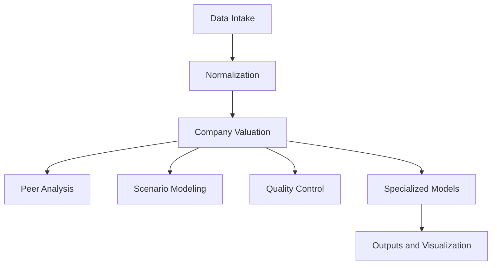

# Valuation System Architecture (Skill-Based)

## Goal
Generate a multi-model valuation pack using skills as execution units.

## 1. End-to-End Flow

## 2. Data Layer
- Sources: filings, market data, industry data, company KPIs
- Frequency: annual, quarterly, daily prices
- Consistency: LTM vs NTM, consolidated vs parent, adjusted vs reported
- Dictionary: standardized fields, units, currency conversions

## 3. Model Selector
- Industry mapping reference: `skills/peer-analysis/references/industry-mapping.md`
- Profitability, growth, capital intensity, regulation
- Capital structure and refinancing profile
- Lifecycle stage: early, growth, mature, decline

## 4. Model Pack
- Anchor model (DCF, NAV, P/B+ROE)
- Relative comps
- Industry-specific model
- Downside floor model

## 5. Outputs
- Valuation range and sensitivities
- Assumptions and data sources
- QA checks and flags
