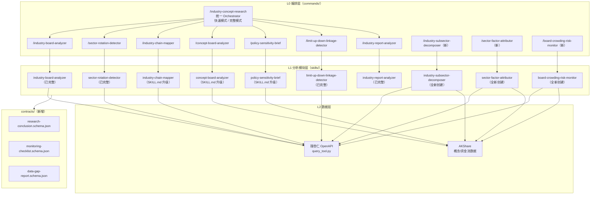

## 用户需求

对 `.claude/plugins/industry-concept-research` 插件进行全面改进和升级，目标是将其从当前"设计态（20分）"提升到 **产品级（30+分）**。

**目标评分明确要求**：逻辑闭环和可复用性两个维度必须达到 **5分（稳定产品级）**。

## 产品概述

`industry-concept-research` 是面向 A 股"行业板块 + 概念板块"研究的一体化分析插件，整合 7 个核心 skill（行业分析、轮动探测、产业链映射、概念分析、政策简报、涨跌停联动、研报分析），以及规划中的 3 个 P0 新 skill（行业细分拆解器、板块因子归因器、板块拥挤度监控）。

## 核心功能

- **统一 Orchestrator 命令入口**：`/industry-concept-research` 主命令具备完整的编排逻辑，支持快速模式/完整模式，能按场景自动调度 skill，并输出结构化研究结论
- **命令层标准化**：8 个命令文件均升级为具备完整输入 contract、参数规范、执行步骤、输出结构说明的正式命令定义（对标 `cn-company-valuation.md` 标准）
- **弱 skill 内容补全**：`concept-board-analyzer`、`policy-sensitivity-brief`、`industry-chain-mapper` 三个 SKILL.md 从通用模板升级为具备差异化分析框架的专项 skill（对标 `sector-rotation-detector` / `limit-up-down-linkage-detector` 质量水准）
- **统一输出 Schema（contracts）**：新建 `contracts/` 目录，定义跨 skill 一致的研究结论结构，包括置信度、风险矩阵、失效触发条件、监控指标等字段
- **统一异常/缺数处理规范**：在 orchestrator 层加入统一 fail-safe 机制，规定模块缺数降级策略、输出警告 vs 拒绝判断的边界
- **3 个 P0 新 skill 落地**：`industry-subsector-decomposer`、`sector-factor-attributor`、`board-crowding-risk-monitor` 完整创建，含 SKILL.md + references/ 三件套
- **plugin.json 元数据文件**：新增插件统一元数据，标明版本、能力边界与依赖声明

## 技术栈

本插件为 Claude Agent 的结构化知识型插件（Markdown + JSON Schema 格式），无需引入额外编程语言框架。技术栈组成：

- **插件格式**：Markdown（SKILL.md、commands/*.md、references/*.md）+ JSON Schema（contracts/*.schema.json）+ JSON（plugin.json）
- **数据查询层**：复用现有 `query_tool.py` + 理杏仁 OpenAPI，部分概念/板块数据使用 AKShare 接口（与现有 concept-board-analyzer 保持一致）
- **参考产品级标准**：对标 `valuation` 插件的 commands 结构（含 `argument-hint`、执行步骤、示例），以及 `regime-lab` 插件的 contracts/ JSON Schema 设计

---

## 实现方案

### 总体策略

采用"先收口、再扩展"的两阶段推进：

1. **阶段一（核心闭环）**：补齐 orchestrator、命令层、contracts、弱 skill 内容——这是从 20 分到 24+ 分的关键。
2. **阶段二（能力扩展）**：落地 3 个 P0 新 skill 及对应命令入口，补全 plugin.json——进一步推向 26-28 分。

### 关键技术决策

**1. 命令文件格式统一**

对标 `regime-lab-market.md` 和 `cn-company-valuation.md` 的成熟格式：

- 必含 YAML frontmatter：`description`、`argument-hint`
- 必含执行步骤（Load skill + 具体操作指令）
- 必含 Example 示例调用

**2. Orchestrator 设计**

`/industry-concept-research` 不是简单 README，而是一个完整的编排指令：

- 根据输入参数（主题、时间窗、模式）决策调用哪些 skill
- 明确 skill 依赖顺序：横截面扫描 → 轮动归因 → 产业链验证 → 政策映射 → 研报校验 → 综合输出
- 融合"结构引擎（Structure Engine）"与"主题引擎（Theme Engine）"双评分

**3. Contracts 设计**

参考 `regime-lab` 的 JSON Schema 设计，新建 **5 个 contract**：

- `research-conclusion.schema.json`：跨 skill 统一结论结构（置信度、驱动因子、风险、失效触发）
- `monitoring-checklist.schema.json`：统一监控清单结构（观测指标、触发阈值、复评时间点）
- `data-gap-report.schema.json`：统一缺数与降级声明结构
- `inter-plugin-interface.schema.json`：**跨插件调用接口声明**——声明本插件哪些输出可被 `valuation`/`regime-lab`/`deep-research` 直接消费，哪些 skill 支持被外部插件独立加载
- `qc-rules.schema.json`：**输出质量校验规则契约**——定义 Orchestrator 输出自检规则（必填字段完整性、置信度阈值、矛盾结论检测规则、三档输出决策：结论/警告/拒绝）

**4. 弱 skill 升级策略**

`concept-board-analyzer`、`policy-sensitivity-brief`、`industry-chain-mapper` 三个 SKILL.md 虽然 references/methodology.md 内容充实，但 SKILL.md 本体是通用模板，缺乏差异化的核心分析框架。升级目标：

- 从"4步通用模板"升级为具有专项分析逻辑的详细工作流（参考 `sector-rotation-detector` SKILL.md 的5支柱/6步 设计）
- 在 SKILL.md 中内联关键指标、阈值、信号定义，不仅仅是引用 references

**5. 3 个 P0 新 skill 创建规范**

按 ROADMAP 定义，每个新 skill 完整创建：

- `SKILL.md`：4步分析流程（输入确认、数据获取、框架分析、结构化输出）
- `references/data-queries.md`：真实 API 查询命令（理杏仁/AKShare）
- `references/methodology.md`：专项分析框架、核心指标、信号规则、降级策略
- `references/output-template.md`：标准输出模板（含置信度、失效条件）
- 辅助文件：`DECISIONS.md`、`INSTALLATION.md`、`LICENSE.txt`、`VERSION`

---

## 实现说明

- **复用约定**：所有数据查询严格使用 `python3 .claude/plugins/query_data/lixinger-api-docs/scripts/query_tool.py`（注意路径为绝对相对路径），不引入新脚本
- **接口一致性**：data-queries.md 中的 API 调用格式与 `industry-board-analyzer/references/data-queries.md` 保持一致（含参数结构、`--columns` 使用规范）
- **降级不静默**：所有降级情形必须在输出中显式标注（`data_gap_note` 字段），不允许无声略过
- **避免漂移**：commands/ 中的命令描述与对应 SKILL.md 中的工作流保持一致，不允许承诺 SKILL.md 中未定义的能力
- **置信度强制**：所有分析输出必须包含置信度声明（参考 `sector-rotation-detector` 中 `基准概率` 字段）
- **QA 闭环强制**：Orchestrator 层必须包含输出 QA 自检步骤，对标 `valuation` 的 `qc_status/errors/warnings` 机制——输出三档决策：`CONCLUSION`（置信度≥60%且关键字段齐全）/`WARNING`（置信度30-60%或存在数据缺口）/`REFUSE`（置信度<30%或核心模块无数据）
- **中间产物强制**：Orchestrator 每个 skill 调用产出 JSON 中间产物（`skill_outputs[]` 字段），而非只写报告，形成可审计的证据链
- **跨插件复用声明强制**：`plugin.json` 必须声明 `reuse_patterns`（5种复用模式）和 `external_consumers`（声明哪些外部插件可直接消费本插件输出），每个 SKILL.md 必须包含"独立调用接口"章节
- **skill 独立可调用**：每个 skill 的 SKILL.md 补充"**§ 独立调用接口**"章节，声明独立输入/输出契约，使每个 skill 均可被 `valuation`/`deep-research` 等外部插件直接加载调用，无需通过 Orchestrator

---

## 架构设计



---

## 目录结构

```
.claude/plugins/industry-concept-research/
├── plugin.json                              # [NEW] 插件元数据，标明版本、能力边界、依赖声明
├── README.md                                # [MODIFY] 补充 contracts/ 目录说明、异常处理规范描述、新增 skill 索引
├── ARCHITECTURE.md                          # [MODIFY] 补充 contracts/ 设计、fail-safe 机制、新 skill 编排位置
├── ROADMAP_INDUSTRY_DETAIL_SKILLS.md        # [MODIFY] 更新 P0 skill 状态为已落地
│
├── contracts/                               # [NEW] 统一输出 Schema 目录（对标 regime-lab/contracts/）
│   ├── research-conclusion.schema.json      # [NEW] 跨 skill 统一研究结论结构，含 confidence/drivers/risks/invalidators
│   ├── monitoring-checklist.schema.json     # [NEW] 统一监控清单结构，含 observable_triggers/review_time
│   ├── data-gap-report.schema.json          # [NEW] 统一缺数与降级声明结构，含 missing_fields/fallback_method/confidence_impact
│   ├── inter-plugin-interface.schema.json   # [NEW] 跨插件调用接口声明：声明可被外部插件消费的输出接口和独立 skill 调用约定
│   └── qc-rules.schema.json                 # [NEW] 输出 QA 自检规则：必填字段/置信度阈值/矛盾检测/三档输出决策（CONCLUSION/WARNING/REFUSE）
│
├── commands/
│   ├── industry-concept-research.md         # [MODIFY] 核心：完整 Orchestrator 编排逻辑，快速/完整两种模式，skill 调度顺序，结构化输出要求
│   ├── industry-board-analyzer.md           # [MODIFY] 升级为含 argument-hint、执行步骤、输出要求、示例调用的完整命令定义
│   ├── sector-rotation-detector.md          # [MODIFY] 同上，补充参数规范和示例
│   ├── industry-chain-mapper.md             # [MODIFY] 同上，补充参数规范和示例
│   ├── concept-board-analyzer.md            # [MODIFY] 同上，补充参数规范和示例
│   ├── policy-sensitivity-brief.md          # [MODIFY] 同上，补充参数规范和示例
│   ├── limit-up-down-linkage-detector.md    # [MODIFY] 同上，补充参数规范和示例
│   ├── industry-report-analyzer.md          # [MODIFY] 同上，补充参数规范和示例
│   ├── industry-subsector-decomposer.md     # [NEW] 行业细分拆解器命令入口
│   ├── sector-factor-attributor.md          # [NEW] 板块因子归因器命令入口
│   └── board-crowding-risk-monitor.md       # [NEW] 板块拥挤度监控命令入口
│
├── skills/
│   ├── industry-board-analyzer/             # [NO CHANGE] 已完整
│   ├── sector-rotation-detector/            # [NO CHANGE] 已完整
│   ├── limit-up-down-linkage-detector/      # [NO CHANGE] 已完整
│   ├── industry-report-analyzer/            # [NO CHANGE] 已完整
│   │
│   ├── industry-chain-mapper/               # [MODIFY] 重点升级 SKILL.md
│   │   ├── SKILL.md                         # [MODIFY] 从通用模板升级为：3层传导分析框架（价格/业绩/供需），内联关键指标与景气判断逻辑，明确下钻到 industry-subsector-decomposer 的协同接口
│   │   └── references/                      # [NO CHANGE] methodology.md 已充实
│   │
│   ├── concept-board-analyzer/              # [MODIFY] 重点升级 SKILL.md
│   │   ├── SKILL.md                         # [MODIFY] 从通用模板升级为：主题生命周期框架（启动-扩散-拥挤-退潮四阶段），内联拥挤度判断、轮动速度信号，与 board-crowding-risk-monitor 的协同接口
│   │   └── references/                      # [NO CHANGE] methodology.md 已充实
│   │
│   ├── policy-sensitivity-brief/            # [MODIFY] 重点升级 SKILL.md
│   │   ├── SKILL.md                         # [MODIFY] 从通用模板升级为：政策链条分层框架（顶层定调→部委细则→地方执行→市场响应），内联政策力度评分与敏感度矩阵，明确情景推演三步骤
│   │   └── references/                      # [NO CHANGE] methodology.md 已充实
│   │
│   ├── industry-subsector-decomposer/       # [NEW] P0 新 skill：行业细分拆解器
│   │   ├── SKILL.md                         # [NEW] 专项分析框架：申万一级→二级→三级下钻，细分强弱分层，Alpha来源识别，输出"下一阶段优先子方向"
│   │   ├── DECISIONS.md                     # [NEW] 设计决策记录
│   │   ├── INSTALLATION.md                  # [NEW] 安装说明
│   │   ├── LICENSE.txt                      # [NEW] 许可证
│   │   ├── VERSION                          # [NEW] 版本号
│   │   └── references/
│   │       ├── data-queries.md              # [NEW] 申万二级/三级行业 API 查询（cn/industry level=two/three），成分股涨跌幅计算
│   │       ├── methodology.md               # [NEW] 细分行业强弱分层算法、贡献度分解公式、Alpha来源判断规则
│   │       └── output-template.md           # [NEW] 细分行业排名表+强弱分层+优先子方向输出模板
│   │
│   ├── sector-factor-attributor/            # [NEW] P0 新 skill：板块因子归因器
│   │   ├── SKILL.md                         # [NEW] 专项分析框架：估值扩张/EPS预期上修/风险溢价变化三维归因，风格因子暴露（大小盘/成长价值/质量红利），归因置信度与证据缺口声明
│   │   ├── DECISIONS.md                     # [NEW]
│   │   ├── INSTALLATION.md                  # [NEW]
│   │   ├── LICENSE.txt                      # [NEW]
│   │   ├── VERSION                          # [NEW]
│   │   └── references/
│   │       ├── data-queries.md              # [NEW] 行业PE/PB历史序列查询（用于估值变化）、行业市值查询（用于收益率计算）、宏观指标（利率/社融）
│   │       ├── methodology.md               # [NEW] 收益拆解三步法（估值贡献+盈利贡献+风险溢价变化），风格因子暴露矩阵，降级策略（缺盈利预期数据时用半归因）
│   │       └── output-template.md           # [NEW] 归因拆解表+风格因子暴露+归因置信度输出模板
│   │
│   └── board-crowding-risk-monitor/         # [NEW] P0 新 skill：板块拥挤度监控
│       ├── SKILL.md                         # [NEW] 专项分析框架：拥挤度评分（换手分位+成交占比+估值分位+资金集中度），脆弱触发器识别（量价背离/成交萎缩/龙头破位），降仓/观察建议
│       ├── DECISIONS.md                     # [NEW]
│       ├── INSTALLATION.md                  # [NEW]
│       ├── LICENSE.txt                      # [NEW]
│       ├── VERSION                          # [NEW]
│       └── references/
│           ├── data-queries.md              # [NEW] 换手率历史分位查询（cn/industry fundamental to_r），行业成交占比计算，估值分位（pe_ttm.y10.mcw.cvpos）
│           ├── methodology.md               # [NEW] 拥挤度综合评分公式，五维信号体系，脆弱触发器定义，高中低拥挤度对应操作建议
│           └── output-template.md           # [NEW] 拥挤度仪表盘+脆弱触发器清单+降仓建议输出模板
```

## Agent Extensions

### Skill

- **skill-creator**
- 用途：用于创建 3 个 P0 新 skill（`industry-subsector-decomposer`、`sector-factor-attributor`、`board-crowding-risk-monitor`）以及升级弱 skill 的 SKILL.md 内容，确保符合最佳实践
- 预期结果：每个新 skill 生成完整的 SKILL.md + references/ 三件套，内容质量对标现有 `sector-rotation-detector` 水准