# Design Document: Valuation Plugin Improvements

## Overview

本文档描述 Valuation Plugin 的系统性改进方案，涵盖数据源 commands 清理、单元测试补充、文档与代码对齐、无脚本 skills 可执行层建设、以及端到端回归验证等方面。P0 级代码 bug（NWC 变化量、mid-year convention、IRR 范围、浮点比较）已在 `auto_valuation.py` 中直接修复，本文档聚焦 P1~P3 的设计层面改进。

改进目标：提升插件的可靠性（测试覆盖）、可维护性（文档与代码对齐）、可执行性（消除无效脚本引用）、以及可发现性（补全文档与示例）。

## Architecture

```mermaid
graph TD
    subgraph Commands Layer
        C1[finnhub-quote]
        C2[fmp-quote]
        C3[alphavantage-quote]
        C4[tiingo-eod]
        C5[eulerpool-income-statement]
        C6[massive-agg-bars]
        C7[test-data-sources]
    end

    subgraph Skills Layer
        S1[company-valuation]
        S2[peer-analysis]
        S3[scenario-modeling]
        S4[ev-equity-bridge]
        S5[resource-valuation]
        S6[project-finance]
        S7[vc-startup-model]
        S8[quality-control]
        S9[cn-data-source]
    end

    subgraph Core Engine
        E1[auto_valuation.py]
        E2[build_comps.py NEW]
        E3[vc_model.py NEW]
        E4[validate_sample.py NEW]
    end

    subgraph References
        R1[industry-models.md]
        R2[model-weighting.md]
        R3[field-provider-map.md NEW]
        R4[ENV_SETUP.md NEW]
    end

    C1 -->|LLM 指令模式| query_data_plugin
    C2 -->|LLM 指令模式| query_data_plugin
    C3 -->|LLM 指令模式| query_data_plugin
    C4 -->|LLM 指令模式| query_data_plugin
    C5 -->|LLM 指令模式| query_data_plugin
    C6 -->|LLM 指令模式| query_data_plugin
    C7 -->|LLM 指令模式| query_data_plugin

    S1 --> E1
    S2 --> E2
    S3 --> E1
    S4 --> E1
    S5 --> E1
    S6 --> E1
    S7 --> E3
    S8 --> E1

    S9 --> R3
    E4 -->|回归验证| E1
```



## Components and Interfaces

### Component 1: 数据源 Commands（LLM 指令模式重构）

**Purpose**: 将 7 个依赖不存在脚本的 command 改为纯 LLM 指令风格，消除无效路径引用。

**受影响 Commands**:
- `finnhub-quote.md`
- `fmp-quote.md`
- `alphavantage-quote.md`
- `tiingo-eod.md`
- `eulerpool-income-statement.md`
- `massive-agg-bars.md`
- `test-data-sources.md`

**重构后接口规范**（每个 command 包含）:

```markdown
---
description: [功能描述]
argument-hint: "[symbol]"
---

## 环境变量
- `[PROVIDER]_API_KEY`: 从环境变量读取

## 执行方式
通过 query_data plugin 的工具直接调用，无需本地脚本。

## API Endpoint
- URL: [endpoint]
- Method: GET
- 关键参数: symbol, [其他参数]

## 期望返回字段
- [field1]: [描述]
- [field2]: [描述]

## 示例
`/[command-name] AAPL`
```

**Responsibilities**:
- 描述所需环境变量
- 说明 API endpoint 和参数
- 列出期望返回字段
- 不引用任何本地脚本路径

---

### Component 2: 单元测试（test_auto_valuation.py）

**Purpose**: 为 `auto_valuation.py` 这个精度敏感的计算引擎提供测试覆盖。

**文件路径**: `.claude/plugins/valuation/skills/company-valuation/scripts/test_auto_valuation.py`

**测试接口**:

```python
class TestDCFCalculation:
    def test_dcf_basic(self): ...          # PV 计算含 mid-year 与手算一致
    def test_nwc_delta(self): ...          # NWC 用变化量而非余额
    def test_terminal_value_share(self): ... # terminal_share > 0.75 触发 warning

class TestCompsValuation:
    def test_comps_ev_vs_equity(self): ... # ev_ebitda 走 EV bridge，pe 不走

class TestInputNormalization:
    def test_normalize_inputs_qoe(self): ... # QoE 调整后 normalized_ebit 正确

class TestEdgeCases:
    def test_irr_high_growth(self): ...    # IRR > 100% 场景正常返回
    def test_safe_ratio_near_zero(self): ... # denominator 为 1e-11 返回 None
```

**Responsibilities**:
- 覆盖 DCF 核心计算路径
- 覆盖 NWC 变化量逻辑
- 覆盖 comps EV bridge 路径分叉
- 覆盖边界条件（IRR 上限、浮点安全除法）
- 使用 `examples/sample_input.json` 作为 fixture

---

### Component 3: industry-models.md 实现状态标注

**Purpose**: 消除文档列出模型与代码实际实现之间的歧义。

**文件路径**: `.claude/plugins/valuation/skills/company-valuation/references/industry-models.md`

**新增实现状态表**:

```markdown
## 实现状态

| 模型 | 状态 | 执行方式 |
|---|---|---|
| FCFF DCF | ✅ 已实现 | auto_valuation.py |
| Comps (EV/EBITDA, P/E 等) | ✅ 已实现 | auto_valuation.py |
| Financials (P/B + ROE, DDM) | ✅ 已实现 | calc_financials_model |
| Resource (NAV/rNPV) | ✅ 已实现 | calc_resource_model |
| Project Finance | ✅ 已实现 | calc_project_finance_model |
| EV/ARR, P/User (SaaS/平台) | 🔲 LLM 辅助 | vc-startup-model skill |
| RNAV (地产开发商) | 🔲 LLM 辅助 | 待实现 |
| P/FFO (REITs) | 🔲 LLM 辅助 | 待实现 |
| RAB DCF (受监管公用事业) | 🔲 LLM 辅助 | 待实现 |
```

---

### Component 4: model-weighting.md 扩展

**Purpose**: 补全缺失的行业场景权重指导，覆盖 SOTP、REITs、pre-revenue 等。

**文件路径**: `.claude/plugins/valuation/skills/company-valuation/references/model-weighting.md`

**新增场景**:

```markdown
## 扩展场景

| 场景 | 权重方案 |
|---|---|
| SOTP（集团/多业务） | 各业务线独立估值后加总，不做跨业务线权重混合 |
| REITs | 70% P/FFO，30% NAV（资产重置价值） |
| Pre-revenue / 早期 | 100% VC Method 或 First Chicago，不使用 DCF |
| 银行 | 70% P/B + ROE，30% Residual Income；不使用 EV 类指标 |
| 地产开发商 | 80% RNAV，20% P/E（基于结转利润） |
| 受监管公用事业 | 70% RAB DCF，30% EV/EBITDA |

## 优先级规则
当 `industry_model` 字段存在时，`calc_industry_model` 的输出权重优先于默认 DCF/comps 权重。
```

---

### Component 5: A 类 Skills 补充 Examples

**Purpose**: 为已有 `auto_valuation.py` 函数支撑的 skills 补充可执行示例，提升可发现性。

**受影响 Skills**:

| Skill | 对应函数 | 补充内容 |
|---|---|---|
| `scenario-modeling` | `calc_scenarios` | `examples/sample_input.json` + `examples/sample_output.json` |
| `ev-equity-bridge` | `ev_to_equity` | `examples/sample_input.json` + `examples/sample_output.json` |
| `resource-valuation` | `calc_resource_model` | `examples/sample_input.json` + `examples/sample_output.json` |
| `project-finance` | `calc_project_finance_model` | `examples/sample_input.json` + `examples/sample_output.json` |
| `quality-control` | `run_additional_qc` | `examples/sample_input.json` + `examples/sample_output.json` |

---

### Component 6: B 类 Skills 新增脚本

**Purpose**: 为 `peer-analysis` 和 `vc-startup-model` 补充独立计算脚本。

#### build_comps.py

**文件路径**: `.claude/plugins/valuation/skills/peer-analysis/scripts/build_comps.py`

```python
# 接口设计
def build_comps(
    peers: list[dict],          # peer list with ticker, metrics
    target: dict,               # target company metrics
    multiples: list[str],       # e.g. ["ev_ebitda", "pe", "pb"]
    period_basis: str = "LTM"   # "LTM" or "NTM"
) -> dict:
    # 返回: multiples_table, summary_stats, implied_range
    ...
```

#### vc_model.py

**文件路径**: `.claude/plugins/valuation/skills/vc-startup-model/scripts/vc_model.py`

```python
# 接口设计
def calc_vc_method(
    revenue_or_arr: float,
    growth_rate: float,
    exit_multiple: float,
    target_return: float,
    dilution: float,
    exit_year: int
) -> dict:
    # 返回: pre_money, post_money, ownership_impact
    ...

def calc_first_chicago(
    scenarios: list[dict],  # [{name, prob, exit_value}]
    target_return: float,
    dilution: float
) -> dict:
    # 返回: scenario_table, weighted_pre_money, weighted_post_money
    ...
```

---

### Component 7: cn-data-source 结构化路由

**Purpose**: 在 SKILL.md 中补充决策树，减少 Claude 自由发挥的不确定性。

**新增内容**（追加到 `cn-data-source/SKILL.md`）:

```markdown
## Provider 路由决策树

1. 目标字段是否在理杏仁覆盖范围？
   - 是 → 使用 lixinger query_tool.py
   - 否 → 继续

2. 是否是现金流/宏观字段？
   - 是 → 使用 AkShare
   - 否 → 继续

3. 是否是美股/港股数据？
   - 是 → 按 query_data plugin 的 provider 文档选择
   - 否 → 标记为"数据缺口"，在 source_notes 中说明
```

**新增文件**: `.claude/plugins/valuation/skills/cn-data-source/references/field-provider-map.md`

---

### Component 8: 端到端回归验证脚本

**Purpose**: 自动化验证 `auto_valuation.py` 的计算结果不因代码改动而静默漂移。

**文件路径**: `.claude/plugins/valuation/skills/company-valuation/scripts/validate_sample.py`

```python
# 接口设计
def validate_sample(
    input_path: str = "examples/sample_input.json",
    expected_path: str = "examples/valuation_summary.json",
    tolerance: float = 0.01   # ±1%
) -> ValidationResult:
    # 关键字段: enterprise_value, equity_value, terminal_share, implied_terminal_ev_ebitda
    # 返回: passed, diffs, summary
    ...
```

**集成方式**:
```bash
# 追加到 regression_tests/run_tests.sh
python .claude/plugins/valuation/skills/company-valuation/scripts/validate_sample.py
```

## Data Models

### 单元测试 Fixture 结构

```python
# sample_input.json 关键字段（用于测试 fixture）
{
  "company": {
    "name": str,
    "ticker": str,
    "industry": str
  },
  "financials": {
    "revenue": [float],        # 历史收入序列
    "ebitda": [float],
    "ebit": [float],
    "net_income": [float],
    "capex": [float],
    "nwc": [float]             # 净营运资本余额序列（计算变化量用）
  },
  "balance_sheet": {
    "cash": float,
    "debt": float
  },
  "assumptions": {
    "wacc": float,
    "terminal_growth": float,
    "forecast_years": int,
    "mid_year_convention": bool
  }
}
```

### build_comps 输出结构

```python
{
  "multiples_table": [
    {
      "ticker": str,
      "ev_ebitda": float | None,
      "pe": float | None,
      "pb": float | None,
      "period_basis": str      # "LTM" or "NTM"
    }
  ],
  "summary_stats": {
    "ev_ebitda": {"median": float, "p25": float, "p75": float, "count": int},
    "pe": {"median": float, "p25": float, "p75": float, "count": int}
  },
  "implied_range": {
    "low": float,
    "mid": float,
    "high": float
  }
}
```

### vc_model 输出结构

```python
{
  "pre_money": float,
  "post_money": float,
  "scenario_table": [
    {"name": str, "prob": float, "exit_value": float, "pv": float}
  ],
  "ownership_impact": {
    "pre_dilution": float,
    "post_dilution": float
  }
}
```

### ValidationResult 结构

```python
{
  "passed": bool,
  "diffs": [
    {
      "field": str,
      "expected": float,
      "actual": float,
      "delta_pct": float,
      "within_tolerance": bool
    }
  ],
  "summary": str
}
```

## Error Handling

### 数据源 Commands

- 环境变量缺失：在 command 描述中明确说明所需变量，Claude 在执行前检查并提示用户配置
- API 调用失败：返回错误信息，不静默失败

### 单元测试

- fixture 文件缺失：测试跳过并输出 warning，不阻断其他测试
- 计算结果超出容差：明确输出期望值、实际值、差异百分比

### validate_sample.py

- 容差超出：输出详细 diff，exit code 非零，可被 CI 捕获
- 关键字段缺失：标记为 MISSING，整体标记为 FAILED

## Testing Strategy

### 单元测试方法

**测试库**: pytest

**运行命令**:
```bash
python -m pytest .claude/plugins/valuation/skills/company-valuation/scripts/test_auto_valuation.py -v
```

**覆盖目标**:

| 测试用例 | 验证目标 | 类型 |
|---|---|---|
| `test_dcf_basic` | PV 计算（含 mid-year）与手算一致 | 精度验证 |
| `test_nwc_delta` | NWC 用变化量，FCF 在稳定增长时高于旧逻辑 | 逻辑验证 |
| `test_terminal_value_share` | terminal_share > 0.75 触发 warning | 边界验证 |
| `test_comps_ev_vs_equity` | ev_ebitda 走 EV bridge，pe 不走 | 路径验证 |
| `test_normalize_inputs_qoe` | QoE 调整后 normalized_ebit 正确 | 计算验证 |
| `test_irr_high_growth` | IRR > 100% 场景正常返回 | 边界验证 |
| `test_safe_ratio_near_zero` | denominator 为 1e-11 返回 None | 安全验证 |

### 端到端回归验证

**运行命令**:
```bash
python .claude/plugins/valuation/skills/company-valuation/scripts/validate_sample.py
```

**验证字段**: `enterprise_value`, `equity_value`, `terminal_share`, `implied_terminal_ev_ebitda`

**容差**: ±1%

## Security Considerations

- API Key 不硬编码在任何 command 或脚本中，统一通过环境变量读取
- `ENV_SETUP.md` 只说明变量名和获取方式，不包含实际 key 值
- `.gitignore` 补充输出目录，防止含敏感数据的输出文件被意外提交

## Dependencies

| 依赖 | 用途 | 已有/新增 |
|---|---|---|
| pytest | 单元测试运行 | 需确认已安装 |
| auto_valuation.py | 核心计算引擎 | 已有 |
| query_data plugin | 数据源执行层 | 已有 |
| lixinger query_tool.py | A 股数据查询 | 已有 |
| sample_input.json | 测试 fixture | 已有（需确认路径） |
| valuation_summary.json | 回归基准 | 已有（需确认路径） |
